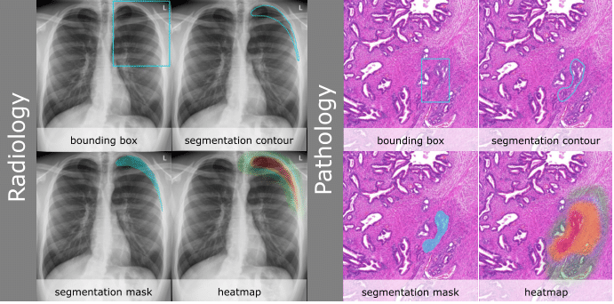

# Visual Representation of AI-Recommender System Results for Medical Decision Making

This repository contains the code that was used for our MuC'23 Short Paper submission *Appealing but Potentially Biasing - Investigation of the Visual Representation of Segmentation Predictions by AI Recommender Systems for Medical Decision Making*. 

## Acknowledgements

J.A. acknowleges funding by the [Bavarian Institute for Digital Transformation](https://badw.de/bayerisches-forschungsinstitut-fuer-digitale-transformation.html) from the Project [ReGInA](https://en.bidt.digital/regina/).